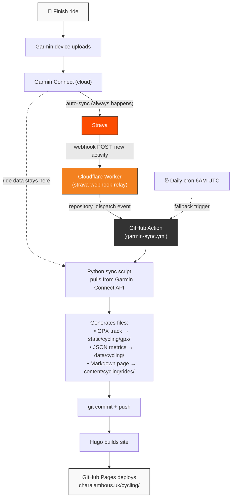

# Cycling Tracker

Cycling activities from Garmin, displayed on charalambous.uk/cycling/.

## How It Works



### Key Points

- **Strava is just the doorbell** — it triggers the pipeline, but no ride data comes from Strava. Your Strava activities can stay private.
- **All ride data comes from Garmin Connect** — the Python script authenticates with your Garmin credentials and downloads GPX/metrics directly.
- **Daily cron as fallback** — if the webhook misses an event, the 6 AM UTC scheduled run catches anything new.
- **Two triggers, same action** — both the Strava webhook and the daily cron run the exact same sync script.

## Project Structure

```
content/cycling/          Hugo content (dashboard + ride pages)
data/cycling/             JSON data (summary, recent rides, per-activity metrics)
static/cycling/gpx/       GPX track files for map rendering
layouts/cycling/          Hugo templates (Leaflet.js maps, Chart.js charts)
scripts/garmin-sync/      Python sync script (pulls from Garmin Connect)
webhook/                  Cloudflare Worker (Strava webhook → GitHub Action)
.github/workflows/garmin-sync.yml   GitHub Action (cron + webhook trigger)
```

## Setup

### 1. GitHub Secrets

Add these to the blog repo (Settings → Secrets → Actions):

| Secret | Value |
|--------|-------|
| `GARMIN_EMAIL` | Your Garmin Connect email |
| `GARMIN_PASSWORD` | Your Garmin Connect password |

### 2. Test the Sync Locally

```bash
cd scripts/garmin-sync
pip install -r requirements.txt
GARMIN_EMAIL=you@email.com GARMIN_PASSWORD=yourpass python sync.py
```

This pulls your recent rides and generates Hugo files. Run `hugo server` to preview.

### 3. Deploy the Strava Webhook (Instant Sync)

This makes your site update within minutes of finishing a ride.

**a) Deploy the Cloudflare Worker:**

```bash
cd webhook
npx wrangler login
npx wrangler deploy
```

Note the URL it gives you (e.g. `https://strava-webhook-relay.your-subdomain.workers.dev`).

**b) Set Worker environment variables** in Cloudflare dashboard (Workers → strava-webhook-relay → Settings → Variables):

| Variable | Value |
|----------|-------|
| `STRAVA_VERIFY_TOKEN` | Any random string you choose |
| `GITHUB_TOKEN` | GitHub personal access token with `repo` scope ([create here](https://github.com/settings/tokens/new)) |
| `GITHUB_REPO` | `GeorgeChara/blog` |

Mark `GITHUB_TOKEN` as encrypted.

**c) Register the Strava webhook subscription:**

Your Strava API credentials are in `/Users/george/programming/cycling/cycling-dashboard/.env` (client ID: 180279).

```bash
curl -X POST https://www.strava.com/api/v3/push_subscriptions \
  -F client_id=180279 \
  -F client_secret=YOUR_STRAVA_CLIENT_SECRET \
  -F callback_url=https://strava-webhook-relay.YOUR_SUBDOMAIN.workers.dev \
  -F verify_token=YOUR_CHOSEN_VERIFY_TOKEN
```

Should return `{"id": 12345, ...}` — you're done.

### 4. Verify End-to-End

1. Create a manual activity on Strava (or go for a ride)
2. Check GitHub Actions tab — `Sync Garmin Activities` should trigger
3. After it completes, charalambous.uk/cycling/ shows the new ride

### Troubleshooting

**Check worker logs:** `cd webhook && npx wrangler tail`

**List Strava webhook subscriptions:**
```bash
curl -G https://www.strava.com/api/v3/push_subscriptions \
  -d client_id=180279 -d client_secret=YOUR_SECRET
```

**Delete a subscription:**
```bash
curl -X DELETE "https://www.strava.com/api/v3/push_subscriptions/ID" \
  -d client_id=180279 -d client_secret=YOUR_SECRET
```

**Run sync manually:** Go to GitHub Actions → Sync Garmin Activities → Run workflow.

**Garmin MFA:** If your Garmin account has MFA, authenticate once locally first, then copy the session token to a GitHub secret. See `scripts/garmin-sync/garmin_client.py` for token path details.
